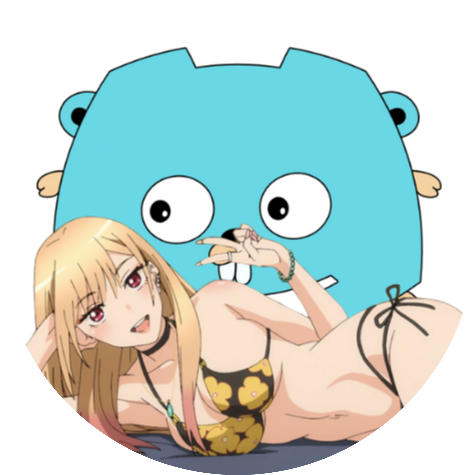

# Marin

Marin, DiscordGo ile geliştirilmeye açık bir bottur.

## Nasıl Kullanılır

Marin'i sunucunuza davet etmek ve kullanmaya başlamak için aşağıdaki adımları izleyin:

1. Marin botunun [davet bağlantısına](https://discord.com/api/oauth2/authorize?client_id=1166121867602575471&permissions=552376854582&scope=applications.commands%20bot) tıklayarak botu sunucunuza ekleyin.

2. Botunuzu sunucunuza ekledikten sonra, aşağıdaki komutları kullanarak Marin'in özelliklerinden yararlanabilirsiniz:
   - `/avatar`: İsterseniz kendi avatarınızı isterseniz başka bir kişinin avatarını görmenizi sağlar.
   - `/rolsec`: Yeni bir üye katıldığında ona verilecek otomatik rolü ayarlamak için kullanılır.
   - `/kanalayarla`: Yeni üye girişlerinde; Göndereceğiniz mesajı ve kanalı ayarlamak için kullanılır.

## Destek

Marin hakkında sorularınız veya sorunlarınız varsa, lütfen [Destek Sunucusu](https://discord.gg/3S5HqG2gnb) üzerinden bize ulaşın. Ayrıca bot hakkında geri bildirimlerinizi ve önerilerinizi de bekliyoruz.

## Katkıda Bulunma

Eğer Marin'in geliştirilmesine katkıda bulunmak isterseniz, lütfen GitHub deposunu ziyaret edin: [GitHub - Marin](https://github.com/minorusora/marin). Katkılarınızı bekliyoruz!

## Lisans

Bu proje [MIT lisansı](LICENSE) altında lisanslanmıştır. Daha fazla bilgi için lisans dosyasını inceleyin.

---

**Marin** | Katkısı bulunan herkese Teşekkür Ederiz.
